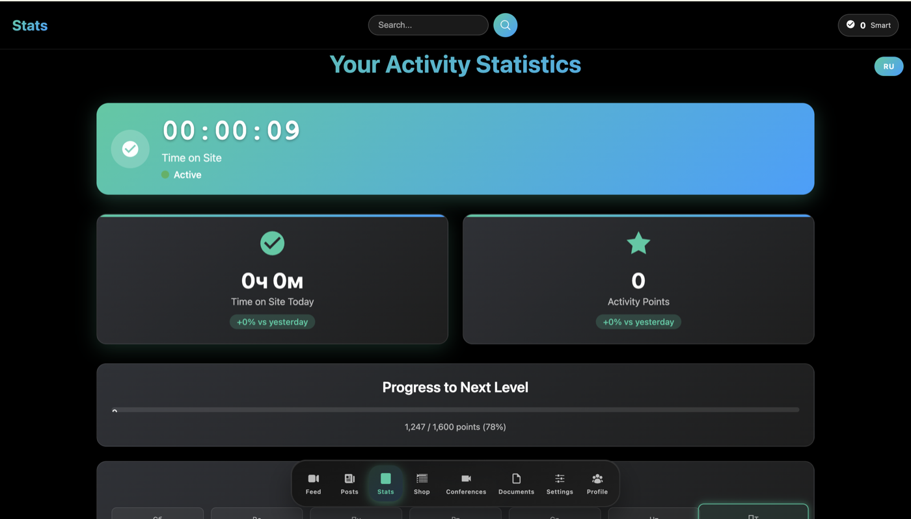
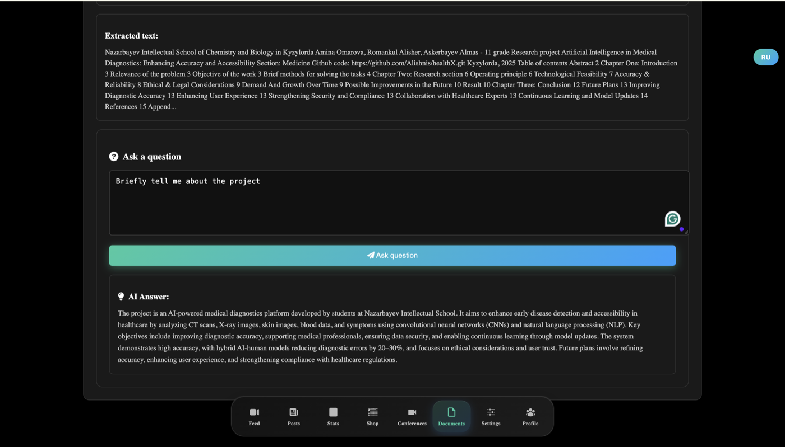
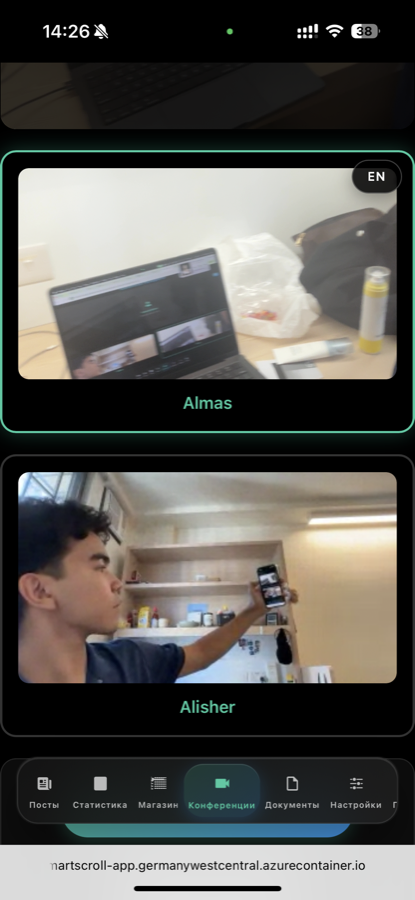

# SmartScroll

SmartScroll turns the endless-scroll feed (YouTube + Reddit) into a study tool: it adds AI summaries and quizzes to each item, a document Q&A page, activity stats, and a video-conferencing room for group study, as a plain static site plus two small Node services, containerized and deployed to Azure.

**Live demo:** https://smartscroll-app.germanywestcentral.azurecontainer.io
**Demo video:** https://youtu.be/Zl6iXgb3fuk?si=xMeAGrdKMMrhBxiO

> Reddit search, AI features and video rooms need real API keys behind the server (see [Configuration](#configuration)). Without them the app still loads; Reddit search falls back to the public endpoint, `/ai/chat` answers 503, and `/token` answers 500.

## Screenshots

| Feed: AI video summary | Feed: AI-generated quiz |
|---|---|
|  |  |

| Stats: activity tracking | Document Reader |
|---|---|
|  |  |

**Conferences: Twilio Video room, from a phone**



## Features

| Page | What it does |
|---|---|
| Feed (`feed.html`) | Mixed YouTube/Reddit feed. Per video: AI summary (topics / key points / tips, generated from title and description) and an AI-generated 5-question quiz |
| Posts (`posts.html`) | Reddit search through the server-side OAuth2 proxy |
| Document Reader (`document-reader.html`) | Upload a PDF or DOCX (parsed in the browser with PDF.js / Mammoth), ask questions, get AI answers |
| Flashcards (`flashcard-generator.html`) | AI-generated flashcards |
| Quiz (`quiz-template.html`) | Quiz mode backed by a local question bank (see [Third-party data](#third-party-data)) |
| Stats / Profile / Smart Shop | Activity timer and achievements, a points currency spendable on badges and titles |
| Conference (`conference-template-new.html`) | Twilio Video room: join/create, mute, camera, screen share, picture-in-picture |
| Eye Health (`eye-health.html`) | Break reminders and a brightness monitor |

Details worth knowing:

- **Quizzes are graded from data, not text.** The model is asked for strict JSON; the app builds the quiz DOM itself (unique radio group per question) and compares the chosen option to `correctAnswer` (`feed.html`).
- **Bilingual UI (RU/EN).** One toggle re-translates the page; AI prompts ask the model to answer in the active language.
- **One shared navbar** (`unified-navbar.*`) with an `ss-` CSS prefix so it does not collide with Bootstrap or page CSS.

## Architecture

```
Browser
  |  HTTPS (Let's Encrypt, Azure deployment only)
  v
Caddy (TLS termination, 80/443)               <- not part of docker-compose
  |  localhost:8080
  v
nginx "web" (static HTML/CSS/JS + reverse proxy)
  |  /reddit/*  /ai/*  /proxy  -> cors-proxy   (Node/Express, :3002)
  |  /token                    -> token-server (Node/Express, :3007)
  v
cors-proxy:    Reddit OAuth2 client-credentials flow; /ai/chat -> OpenRouter with a server-held key
token-server:  signs short-lived (1 h) Twilio Video JWTs; Twilio secrets stay server-side

External: Reddit API, OpenRouter, YouTube Data API v3 (called from the browser), Twilio Video
```

Locally, `docker-compose.yml` runs `web`, `cors-proxy` and `token-server` (no Caddy, plain HTTP on port 3000). On Azure Container Instances all four containers share one network namespace, so the same images are pointed at `localhost` through `CORS_PROXY_HOST` / `TOKEN_SERVER_HOST` (see `aci-deploy.yaml`); no code change between environments.

**Why a server-side proxy?** (1) Reddit's OAuth2 client-credentials exchange is CORS-blocked from browsers and needs a client secret; the author reports unauthenticated `.json` requests from the browser were blocked by Reddit. (2) The OpenRouter key is billable, so it must not ship in page source.

## Tech stack

- **Frontend:** plain HTML/CSS/JavaScript, no framework, no build step. Twilio Video SDK, PDF.js, Mammoth.js, Font Awesome, Bootstrap 4 (conference page).
- **Backend:** Node.js 20 + Express: `cors-proxy.js` (Reddit + OpenRouter proxy), `token-server.js` (Twilio tokens, `jsonwebtoken`).
- **Infra:** Docker / Docker Compose, nginx (`envsubst` template for upstream hosts), Caddy, Docker Hub images (`tmpalish/smartscroll-*`), Azure Container Instances.
- **External APIs:** Reddit (OAuth2), YouTube Data API v3, OpenRouter (default model `deepseek/deepseek-v4-flash-0731`, set in `cors-proxy.js`), Twilio Video.

## Quick start

Requires Docker with Compose. This is the supported way to run the app: the front-end calls same-origin `/ai/*`, `/reddit/*`, `/token`, which nginx proxies, so a bare static file server is not enough.

```bash
git clone <this-repo-url>
cd <repo>/smart_scroll2
cp .env.example .env      # fill in real keys (all optional, see Configuration)
docker compose up --build
# -> http://localhost:3000
```

Verified: with the placeholder `.env.example` values the three containers build and start, `http://localhost:3000/` and `/feed.html` return 200, `/token?identity=demo` returns a signed JWT, and `POST /ai/chat` reaches OpenRouter (which rejects the placeholder key).

### Deploy to Azure Container Instances

```bash
cd smart_scroll2
az login
az group create --name smartscroll-rg --location germanywestcentral

# build + push each image for linux/amd64 (Apple Silicon defaults to arm64)
for pair in web:web proxy:cors-proxy token:token-server caddy:caddy; do  # Dockerfile suffix:image name
  docker buildx build --platform linux/amd64 -f web/Dockerfile.${pair%%:*} \
    -t tmpalish/smartscroll-${pair##*:}:latest --push web
done

az container create --resource-group smartscroll-rg --file aci-deploy.yaml
```

Before deploying, fill the placeholder values in `aci-deploy.yaml` from your own `.env` and use your own Docker Hub namespace instead of `tmpalish` (image names there are `smartscroll-web`, `smartscroll-cors-proxy`, `smartscroll-token-server`, `smartscroll-caddy`). If you change `dnsNameLabel` or region, update the hostname in `smart_scroll2/web/Caddyfile`; Caddy only requests a certificate for the host it is given.

## Configuration

Set in `smart_scroll2/.env` (gitignored; template: `smart_scroll2/.env.example`). On Azure the same values go into `aci-deploy.yaml`.

| Variable | Used by | Required | Default | Purpose |
|---|---|---|---|---|
| `REDDIT_CLIENT_ID` / `REDDIT_CLIENT_SECRET` | cors-proxy | No | none | Reddit OAuth2 app credentials. Without them search falls back to the public endpoint |
| `REDDIT_USER_AGENT` | cors-proxy | No | `SmartScroll/1.0` | User-Agent sent to Reddit |
| `OPENROUTER_API_KEY` | cors-proxy | For AI features | none | Without it `/ai/chat` returns 503 |
| `OPENROUTER_MODEL` | cors-proxy | No | `deepseek/deepseek-v4-flash-0731` | Model used for summaries, quizzes, Q&A. The `aci-deploy.yaml` template sets `mistralai/mistral-nemo` <!-- TODO(owner): which model does the live demo actually run? --> |
| `TWILIO_ACCOUNT_SID` / `TWILIO_API_KEY` / `TWILIO_API_SECRET` | token-server | For video rooms | none | Twilio API key used to sign access tokens |
| `CORS_PROXY_HOST` / `TOKEN_SERVER_HOST` | web (nginx) | No | `cors-proxy` / `token-server` | Upstream hostnames; `localhost` on Azure |
| `WEB_PORT` | web (nginx) | No | `80` | nginx listen port; `8080` on Azure behind Caddy |

The YouTube Data API key is **not** an environment variable: it is a constant in `smart_scroll2/web/feed.html` and is visible to every visitor, so it must be restricted by HTTP referrer and API in the Google Cloud console.

## Project structure

```
README.md
LICENSE                         MIT
.github/workflows/ci.yml        CI: tests (Node 20) + Docker image build smoke test
smart_scroll2/
  docker-compose.yml            local stack: web, cors-proxy, token-server
  aci-deploy.yaml               Azure Container Instances template (placeholders only)
  .env.example                  configuration template
  docs/screenshots/             images used in this README
  LICENSE                       MIT
  web/
    *.html, *.js, *.css         static front-end (feed, posts, stats, shop, conference, ...)
    cors-proxy.js               Reddit OAuth2 + OpenRouter proxy (Express, :3002)
    token-server.js             Twilio Video token server (Express, :3007)
    nginx.conf.template         same-origin routing to the two services
    Dockerfile.{web,proxy,token,caddy}, Caddyfile
    test/                       node:test suite
    quiz-data-full.js           question bank for the quiz page
```

## Testing

```bash
cd smart_scroll2/web
npm ci
npm test
```

The suite (`web/test/`, Node's built-in test runner, runs in CI) covers: Twilio token signing and claims, behavior without credentials, the `/ai/chat` proxy (503 / 400 / key forwarded server-side), Reddit OAuth2 flow with token caching and public fallback, and static checks that every local script/link a page references exists, that every same-origin API path the front-end calls is routed by nginx, and that no page hardcodes `localhost:3002/3007`. There is no linter configured, and no browser/end-to-end tests: front-end logic that lives inline in the HTML (quiz rendering, stats) is not unit-tested.

## Third-party data

The question bank in `quiz-data-full.js` is derived from [OpenTriviaQA](https://github.com/uberspot/OpenTriviaQA) by uberspot and contributors, licensed under Creative Commons Attribution-ShareAlike 4.0 International (see the `LICENSE` file in the upstream repository). The data was converted to JavaScript for this app; the one-off conversion scripts and the raw dataset copy are no longer in the working tree (they remain in git history).

## Limitations

- **Unauthenticated proxy endpoints.** `/ai/chat` has no auth or rate limiting, so anyone who can reach the site can spend the OpenRouter key; `/proxy?url=` fetches arbitrary URLs server-side. Both are fine for a demo, not for production.
- **Accounts are browser-only.** Login/registration (`auth-script.js`) stores users in `localStorage` with a simple non-cryptographic hash; stats and the points currency are per-browser. There is no user database.
- **The YouTube key ships to the browser** (see Configuration).
- **Basic text-to-speech only.** Text-to-speech uses the browser's `speechSynthesis`; there is no server-side TTS.
- **Conference participant list is simulated.** The page polls `/room/:name`, which only a legacy dev server implements; the deployed token server does not.
- **Reddit fallback is unreliable.** Without Reddit credentials the proxy falls back to the public endpoint, which the author reports Reddit blocks by IP.
- **Mixed Russian/English source.** The UI is bilingual, but code comments and some docs are in Russian.
- **Dependency advisories.** `npm audit` reports advisories against the Express 4.x dependency tree; not yet upgraded.

## Author's role

SmartScroll started as a prototype the author inherited; the work in this repository is auditing, fixing and deploying it. The git history was squashed on 2026-09-18 (first commit `5b9b731`), so the prototype's original authorship is not visible in git. <!-- TODO(owner): confirm both git identities in the log ("Алишер Романкул" and "Alishnis") are you, and name the prototype's original source/authors if you want to credit them. -->

What was changed, from the commit history and code:

- **Removed hardcoded credentials.** Real Reddit/YouTube/OpenAI keys had been committed in plaintext (including in client-side `<script>` tags). They were removed and history squashed (`5b9b731`); Reddit and OpenRouter calls now go through the server-side proxy. <!-- TODO(owner): confirm whether the leaked Reddit, Twilio, YouTube and OpenAI credentials were rotated; the previous README said "rotated", but a comment in the local .env says rotation was still recommended. -->
- **Fixed silent bugs:** the Reddit proxy used the wrong port and path (`/reddit/search.json` vs the real `/reddit/search` route) so it always fell back to demo data; quiz grading was broken (every question shared one radio `name`, correctness guessed by regex), rebuilt around structured JSON (`2327fed`); AI answers were hardcoded to Russian regardless of the UI toggle; stats and time tracking were rewired to reflect real activity (`0c440a4`, `fc3638b`); the currency/reward and achievement flows were fixed and translated (`8ba0ba7`, `303363f`, `0f535f9`).
- **Unified the UI:** single namespaced navbar, Font Awesome icons instead of mixed emoji, mobile-responsive layouts (`af45108`, `d941aa1`).
- **Made it deployable:** replaced localhost API calls with same-origin URLs behind an nginx reverse proxy, containerized the Twilio token server, added Caddy for HTTPS (required for `getUserMedia`), and deployed the four containers to Azure Container Instances (`090c55d`, `ed4723e`, `f298323`).
- **Recruiter-readiness pass (branch `cleanup/recruiter-ready`):** removed the last hardcoded `localhost:3007` token call, fixed `npm start` to run the proxy the image actually runs, completed `.env.example`, added `.gitignore`, tests and CI.

## License

MIT (`LICENSE`; identical copy in `smart_scroll2/LICENSE`).
